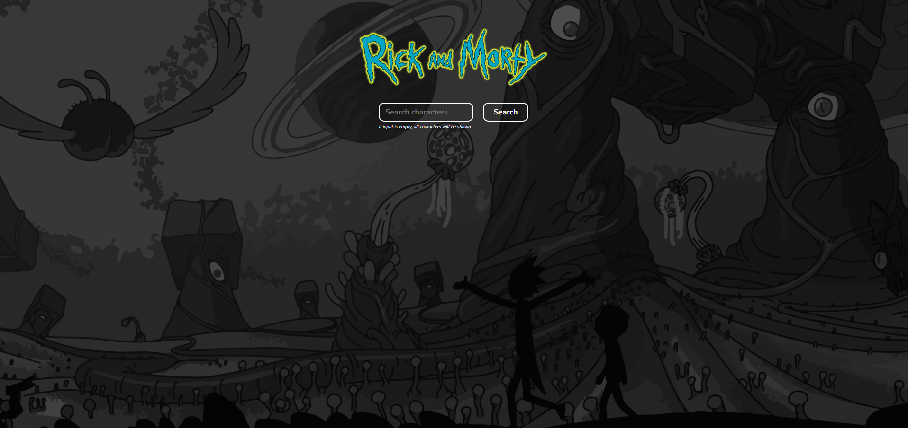

# Rick and Morty - Personal Challenge

<a href="https://rick-and-morty-matricksrocha.vercel.app/"></a>

## 🌍 Website Link

<a href="https://rick-and-morty-matricksrocha.vercel.app/">https://rick-and-morty-matricksrocha.vercel.app/</a>

## 📕 About

My inspiration to work on this project came from the following situation: a friend of mine that is a Frontend developer once had to develop a project very similar to this one to apply for a job opportunity. So as a student trying to get a job as a Frontend Developer and also a Rick and Morty fan, I thought this was a nice website to develop as a personal challenge.

Basically, this is a website where the user can search for all Rick and Morty characters and see some information about them.

This was the first project that I have created using React, so my main objective with this challenge was to start learning about how to use React in my projects and also keep improving my HTML, CSS, JavaScript and API consumption skills.

## 🔨 Tools

- [HTML](https://developer.mozilla.org/en-US/docs/Web/HTML)
- [CSS](https://developer.mozilla.org/en-US/docs/Web/CSS)
- [JavaScript](https://developer.mozilla.org/en-US/docs/Web/JavaScript)
- [Axios](https://axios-http.com/)
- [React](https://react.dev/)
- [Vite](https://vitejs.dev/)

## 💻 Executing the Project

To execute the project in your computer:

```bash
# Clone the project
$ git clone https://github.com/MatricksRocha/RickAndMorty.git
```

```bash
# navigate to the project folder:
$ cd RickAndMorty
```

<strong><u>Using npm:</u></strong>

```bash
# use the "npm install" command to install the dependencies of the project:
$ npm install
```

```bash
# use the "npm run dev" command to run the development server:
$ npm run dev
```

<strong><u>Using yarn:</u></strong>

```bash
# use the "yarn" command to install the dependencies of the project:
$ yarn
```

```bash
# use the "yarn run dev" command to run the development server:
$ yarn run dev
```

## 📝 Developed By

[Matricks Rocha](https://github.com/MatricksRocha) - Frontend Developer <br>
[](https://github.com/MatricksRocha)
[](https://www.linkedin.com/in/matricks-rocha/)